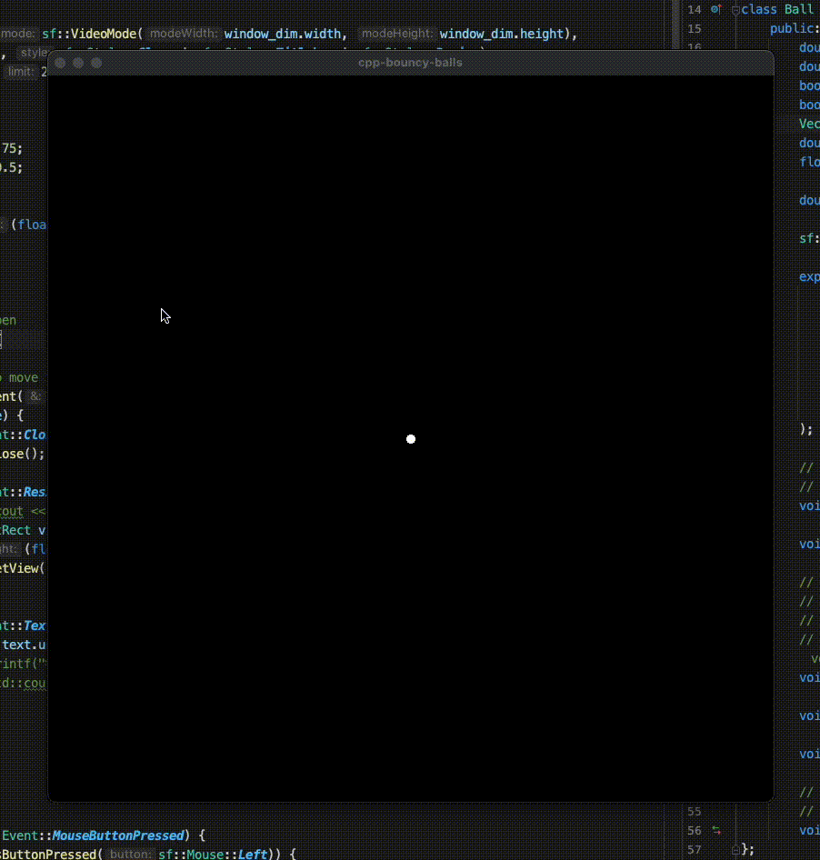

# cpp-bouncy-balls

Demonstrating physics principles and laws in an interactive canvas bouncy ball physics simulation; project related to: https://github.com/dereckdemezquita/ts-bouncy-balls

Left click to shoot out one ball, right click to shoot out a continuous stream of balls.

